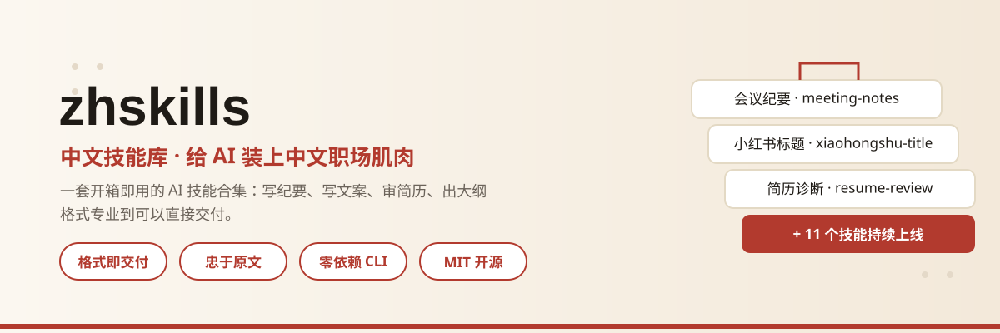
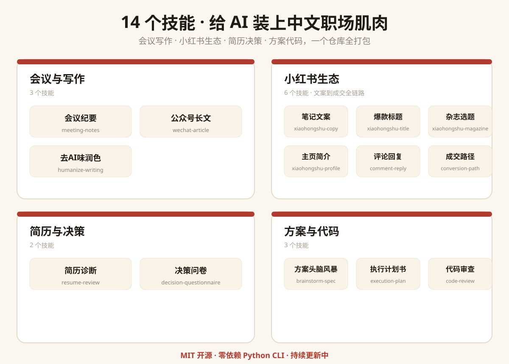

# 中文技能库 · zhskills
> **给 AI 装上中文职场肌肉。**
> 一套开箱即用的 AI 技能合集：安装之后，你的 AI 助手不再是"会聊天的聊天框"，而是**直接能干活的同事**——写纪要、写文案、审简历、出大纲，格式专业到可以直接交付。
<p align="center">
  
  
  
  
</p>
---

<p align="center">
  
</p>

## 为什么需要它？
普通 AI 输出是"流水账"，专业交付是"结构化"。
同样一段会议录音转写稿：
- ❌ **普通用法**：AI 给你一段复述，重点要你自己找，格式全无，发不出去。
- ✅ **中文技能库**：AI 按职场模板输出——一句话摘要、讨论要点、**决议**、**行动项（负责人 + 截止时间）**、遗留问题、风险提示，**打开就能用，改改就能发**。
技能库解决的，正是"AI 会聊天但不会干活"的最后一公里：**输出工程化**。
## 效果对比（示意）
<p align="center">
  
</p>

> 输入为模拟转写稿，用于展示技能库的输出形态。
**转写稿片段（输入）**：
> 00:00 主持人：今天我们开个会，讨论下个月的内容排期。00:12 小王：我觉得公众号可以每周三篇，小红书两天一篇。00:30 李姐：预算方面，这月广告投放剩两万，够不够？00:48 主持人：那就定，公众号每周三篇、小红书每周两篇，投放先用两万。01:05 小王：周五前我把排期表发群里。01:20 主持人：好，那这周目标就是排期定稿，散会。
**普通 AI 的输出**：
> 会议讨论了内容排期。小王说公众号可以每周三篇，小红书两天一篇。李姐问预算，广告投放剩两万。主持人决定公众号每周三篇、小红书每周两篇，投放两万。小王周五前发排期表。这周目标是排期定稿。
**使用「会议纪要」技能后的输出**：
```markdown
# 会议纪要 · 内容排期讨论（示意）
**会议信息**：议题-下月内容排期 ｜ 参会-主持人/小王/李姐 ｜ 时长-约 2 分钟
## 一句话摘要
确定下月内容排期方案：公众号每周 3 篇、小红书每周 2 篇，广告投放预算 2 万元，周五前产出排期表。
## 讨论要点
- **排期方案** [00:12]：小王提出公众号每周 3 篇、小红书每两天 1 篇的初版方案。
- **预算** [00:30]：李姐提示本月广告投放剩余约 2 万元，需评估覆盖度。
## 决议
- [x] 公众号更新频率定为每周 3 篇
- [x] 小红书更新频率定为每周 2 篇
- [x] 广告投放预算沿用 2 万元额度
## 行动项
| 事项 | 负责人 | 截止 |
| --- | --- | --- |
| 输出下月排期表并发群 | 小王 | 周五前 |
## 待确认
- 2 万元投放预算是否覆盖全部渠道，需财务复核（待确认）
## 风险提示
- 排期方案与预算挂钩，预算不足时需回退调整（待确认）
```
**差在哪？** 决议可执行、行动项可跟踪、风险可见——这就是"专业交付"和"聊天记录复述"的差别。用户感受到的，不是一个"技能"的安装动作，而是**输出质量的断崖式提升**。
<p align="center">
  
</p>

## 已收录技能
| 技能 | 状态 | 说明 |
| --- | --- | --- |
| `meeting-notes` 会议纪要 | ✅ 已上线 | 转写稿 → 可交付的结构化纪要（摘要 / 决议 / 行动项 / 风险） |
| `xiaohongshu-copy` 小红书文案 | ✅ 已上线 | 素材 → 标题 / 封面 / 正文 / 标签 / 合规自查 |
| `resume-review` 简历诊断 | ✅ 已上线 | 简历 → 总体评价 / 分级问题 / 逐条改写 / 行动清单 |
| `xiaohongshu-title` 小红书标题 | ✅ 已上线 | 素材 → 12 风格 24 标题 / 方向诊断 / 标题优化（改编自 xiaohongshu-ai-workbench） |
| `decision-questionnaire` 决策问卷 | ✅ 已上线 | 决策点 → 可异步填写的结构化问卷（用途 / 背景 / 分组问题 / 开放题） |
| `brainstorm-spec` 方案头脑风暴 | ✅ 已上线 | 模糊想法 → 设计规格书（路径分级 / 多方案对比 / 风险与待确认 / 自检） |
| `execution-plan` 执行计划书 | ✅ 已上线 | 需求 → 分步执行计划（交付物结构 / 验收检查点 / 无占位符） |
| `code-review` 代码审查 | ✅ 已上线 | 代码改动 → 双轴审查报告（规范合规 / 需求符合） |
| `humanize-writing` 去AI味润色 | ✅ 已上线 | 中文文稿 → 去 AI 味改写稿（31 条规则，保留事实与作者声音） |
| `wechat-article` 公众号长文 | ✅ 已上线 | 主题素材 → 主张清单 / 初稿 / 自审报告 / 定稿建议 |
| `xiaohongshu-magazine` 杂志选题库 | ✅ 已上线 | 账号定位 → 刊魂母题 / 栏目骨架 / 选题池（改编自 xiaohongshu-ai-workbench） |
| `xiaohongshu-profile` 主页简介 | ✅ 已上线 | 主页现状 → 3 秒判断 / 7 维体检 / 4 版简介（改编自 xiaohongshu-ai-workbench） |
| `xiaohongshu-comment-reply` 评论回复 | ✅ 已上线 | 评论 → 5 版回复对照（友好 / 专业 / 评论区风 / 引导私信 / 不建议） |
| `xiaohongshu-conversion-path` 成交路径 | ✅ 已上线 | 产品信息 → 6 段成交路径 + 4 类内容分工（改编自 xiaohongshu-ai-workbench） |
| `ppt-outline` PPT 大纲 | ✅ 已上线 | 材料 → 分页大纲（页序 / 讲稿要点 / 视觉建议）+ 总页数与建议时长 |
| `doc-summary` 文档摘要 | ✅ 已上线 | 长文档 → 决策者视角的一页摘要（一句话结论 / 关键发现 / 风险 / 建议行动） |
| `interview-me` 需求澄清 | ✅ 已上线 | 模糊需求 → 澄清报告（假设+置信度 / 访谈问题清单 / 6 行需求复述）（改编自 addyosmani/agent-skills） |
| `idea-refine` 想法打磨 | ✅ 已上线 | 粗糙想法 → 一页方案（HMW 重述 / 方向四维对比 / Not Doing 清单）（改编自 addyosmani/agent-skills） |
| `systematic-debugging` 根因复盘 | ✅ 已上线 | 问题 → 根因分析报告（四阶段串行 / 单假设验证 / 3 次失败质疑前提）（改编自 obra/superpowers） |
| `verification-before-completion` 交付核验 | ✅ 已上线 | 交付物 → 声明-证据核验报告（无新鲜证据不声称完成）（改编自 obra/superpowers） |
| `contract-guard` 合同审查 | ✅ 已上线 | 合同 → 四分类审查 + 公平评分 + 中国法强制规定对照（改编自 he-yufeng/ContractGuard） |
| `extract-wisdom` 深度提炼 | ✅ 已上线 | 长文 → 多维智慧摘要（核心观点 / 洞察 / 金句 / 行动建议）（改编自 danielmiessler/fabric） |
| `teach` 培训教案 | ✅ 已上线 | 培训主题 → 教案大纲（MISSION 目标 / 提取-间隔-交错练习）（改编自 mattpocock/skills） |
| `proposal-writer` 立项报告 | ✅ 已上线 | 主题+事实 → 立项报告（证据表 / 论证链 / 章节契约 / 四层 QA）（改编自 Yuan1z0825/nature-skills） |
| `academic-polishing` 专业润色 | ✅ 已上线 | 专业文稿 → 结构化润色稿 + 证据边界检查（事实 / 推断 / 建议）（改编自 Yuan1z0825/nature-skills） |
| `xiaohongshu-topic-planner` 选题日历 | ✅ 已上线 | 目标 → 6 类功能选题池 + 优先级 + 发布日历（改编自 xiaohongshu-ai-workbench） |
| `analyze-claims` 信息核查 | ✅ 已上线 | 声明 → 可信度核查报告（拆解 / 证据强度 / 结论 / 需核实清单）（改编自 danielmiessler/fabric） |
| `data-storytelling` 数据叙事 | ✅ 已上线 | 数据 → 叙事化汇报报告（故事框架 / 结论式标题 / 洞察建议）（改编自 wshobson/agents） |
> 技能持续新增中，也欢迎社区贡献（规范见 [docs/CONTRIBUTING.md](docs/CONTRIBUTING.md)）。
## 快速开始（约 10 分钟）
### 1. 安装
```bash
git clone https://github.com/zieang88888/zhskills.git
cd zhskills
./install.sh              # macOS / Linux
# Windows：PowerShell 执行 ./install.ps1
```
安装脚本会把 `skills/` 下的所有技能复制到 `~/.claude/skills/`，一次装完、开箱即用。
### 2. 使用（以会议纪要为例）
**方式 A：对话直接用**
在 Claude 里说一句：
> 用 meeting-notes 技能，帮我整理这份会议记录：[粘贴转写稿]
AI 就会按职业模板输出结构化纪要。
**方式 B：命令行批量处理**（需要任意 OpenAI 兼容 API Key）
```bash
export HX_API_KEY=sk-xxx
python skills/meeting-notes/scripts/draft_meeting_notes.py 转写稿.txt --output 纪要.md
```
### 3. 配置
| 环境变量 | 默认值 | 说明 |
| --- | --- | --- |
| `HX_API_KEY` / `OPENAI_API_KEY` | 无 | API Key（DeepSeek / 通义 / OpenAI 等兼容接口均可） |
| `HX_BASE_URL` | `https://api.deepseek.com/v1` | OpenAI 兼容接口根地址 |
| `HX_MODEL` | `deepseek-chat` | 默认模型 |
## 能力亮点
- **格式即交付**：所有输出按职场模板工程化，打开就能用、改改就能发，不需要二次排版。
- **忠于原文**：只提炼输入中真实出现的信息，绝不脑补；不确定处自动标注"（待确认）"。
- **兼容主流 LLM**：DeepSeek、通义、OpenAI、Claude API……只要接口兼容 OpenAI 协议即可。
- **本地可控**：转写与整理流程自己掌握，脚本仅调用你配置的 API，文本不经过第三方网页。
- **模板可定制**：每个技能带独立模板文件，按你公司的格式改一处即可全局生效。
- **零依赖**：脚本纯 Python 标准库，一条命令跑起来，不需要装任何第三方包。
- **研发向也能打**：代码审查（双轴方法论）、执行计划书（无占位符铁律）让技能库不只服务内容岗。
## 路线图
- [x] **v0.1**：仓库骨架 + 首个技能「会议纪要」
- [x] **v0.2**：小红书文案、简历诊断（已上线）
- [x] **v0.2b**：PPT 大纲、文档摘要（已上线）
- [x] **v0.3**：二次开发批量上线——决策问卷、方案头脑风暴、执行计划书、代码审查、去AI味润色、公众号长文、小红书选题库 / 主页简介 / 评论回复 / 成交路径
- [x] **v0.3b**：二次开发扩容（外国项目本地化 + 中文生态 + 多类别）——需求澄清 / 想法打磨 / 根因复盘 / 交付核验 / 合同审查 / 深度提炼 / 培训教案 / 立项报告 / 专业润色 / 选题日历 / 信息核查 / 数据叙事（已上线）
- [ ] **v0.4**：批量处理 CLI + 自定义模板市场
- [ ] **v0.5**：MCP 版本，接入更多 AI 助手
## 二次开发与致谢
部分技能改编自社区优秀开源项目，均保留原版权与 MIT 许可，完整清单见 [THIRD_PARTY_NOTICES.md](THIRD_PARTY_NOTICES.md)：
- `xiaohongshu-title` ← [xiaohongshu-ai-workbench](https://github.com/mengke-wang/xiaohongshu-ai-workbench)（MIT © 2026 王梦珂）
- `decision-questionnaire` ← [mattpocock/skills](https://github.com/mattpocock/skills)（MIT © 2026 Matt Pocock）
- `brainstorm-spec` ← [obra/superpowers](https://github.com/obra/superpowers)（MIT © 2025 Jesse Vincent）
- `execution-plan` ← [obra/superpowers](https://github.com/obra/superpowers)（MIT © 2025 Jesse Vincent）
- `code-review` ← [mattpocock/skills](https://github.com/mattpocock/skills)（MIT © 2026 Matt Pocock）
- `humanize-writing` ← [op7418/humanizer-zh](https://github.com/op7418/humanizer-zh)（MIT © 2026 歸藏）
- `wechat-article` ← [oaker-io/wewrite](https://github.com/oaker-io/wewrite)（MIT © 2026 OpenClaw）
- `xiaohongshu-magazine` ← [xiaohongshu-ai-workbench](https://github.com/mengke-wang/xiaohongshu-ai-workbench)（MIT © 2026 王梦珂）
- `xiaohongshu-profile` ← [xiaohongshu-ai-workbench](https://github.com/mengke-wang/xiaohongshu-ai-workbench)（MIT © 2026 王梦珂）
- `xiaohongshu-comment-reply` ← [xiaohongshu-ai-workbench](https://github.com/mengke-wang/xiaohongshu-ai-workbench)（MIT © 2026 王梦珂）
- `xiaohongshu-conversion-path` ← [xiaohongshu-ai-workbench](https://github.com/mengke-wang/xiaohongshu-ai-workbench)（MIT © 2026 王梦珂）
- `interview-me` ← [addyosmani/agent-skills](https://github.com/addyosmani/agent-skills)（MIT © 2025 Addy Osmani）
- `idea-refine` ← [addyosmani/agent-skills](https://github.com/addyosmani/agent-skills)（MIT © 2025 Addy Osmani）
- `systematic-debugging` ← [obra/superpowers](https://github.com/obra/superpowers)（MIT © 2025 Jesse Vincent）
- `verification-before-completion` ← [obra/superpowers](https://github.com/obra/superpowers)（MIT © 2025 Jesse Vincent）
- `contract-guard` ← [he-yufeng/ContractGuard](https://github.com/he-yufeng/ContractGuard)（MIT）
- `extract-wisdom` ← [danielmiessler/fabric](https://github.com/danielmiessler/fabric)（MIT）
- `teach` ← [mattpocock/skills](https://github.com/mattpocock/skills)（MIT © 2026 Matt Pocock）
- `proposal-writer` ← [Yuan1z0825/nature-skills](https://github.com/Yuan1z0825/nature-skills)（Apache-2.0）
- `academic-polishing` ← [Yuan1z0825/nature-skills](https://github.com/Yuan1z0825/nature-skills)（Apache-2.0）
- `xiaohongshu-topic-planner` ← [xiaohongshu-ai-workbench](https://github.com/mengke-wang/xiaohongshu-ai-workbench)（MIT © 2026 王梦珂）
- `analyze-claims` ← [danielmiessler/fabric](https://github.com/danielmiessler/fabric)（MIT）
- `data-storytelling` ← [wshobson/agents](https://github.com/wshobson/agents)（MIT © 2024 Seth Hobson）
## 点亮计划 ⭐
如果这个技能库帮到了你，**点一个 Star** 就是对我们最大的支持——每一个 Star 都会让我们继续把下一个技能做得更好。
## 贡献
欢迎贡献新技能，简单到一个文件夹。核心要求只有两条：**格式可交付、内容忠于原文**。详见 [docs/CONTRIBUTING.md](docs/CONTRIBUTING.md)。
## License
MIT © 2026 中文技能库（zhskills）贡献者
---
*智能工具的输出请人工复核后使用，重要决策以原始材料为准。*
